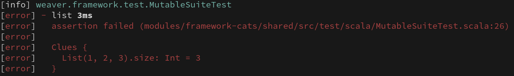

[](https://github.com/typelevel/weaver-test/actions/workflows/ci.yml)
[](https://index.scala-lang.org/typelevel/weaver-test/weaver-core)
[](https://discord.gg/xQETVDrGxy)
[](https://github.com/scala-steward-org/scala-steward)
# Weaver-test

A test-framework built on [cats-effect](https://github.com/typelevel/cats-effect) and
[fs2](https://github.com/functional-streams-for-scala/fs2)

## Installation

Weaver-test is currently published for **Scala 2.12, 2.13, and 3.0**

### SBT

Refer to the [releases](https://github.com/typelevel/weaver-test/releases) page to know the latest released version, and add the following (or scoped equivalent) to your `build.sbt` file.

#### 1.9.0+

Newer versions of SBT have [`weaver` automatically integrated](https://github.com/sbt/sbt/pull/7263).

```scala
libraryDependencies +=  "org.typelevel" %% "weaver-cats" % "x.y.z" % Test
```

#### older versions

Internally, SBT has a hardcoded list of test frameworks it integrates with. `weaver` must be manually added to this list.

```scala
libraryDependencies +=  "org.typelevel" %% "weaver-cats" % "x.y.z" % Test
testFrameworks += new TestFramework("weaver.framework.CatsEffect")
```

## Motivation


Weaver aims at providing a nice experience when writing and running tests :

- tests within a suite are run in parallel by default for quickest results possible
- expectations (ie assertions) are composable values. This forces
  developers to separate the scenario of the test from the checks they perform,
  which generally keeps tests cleaner / clearer.
- failures are aggregated and reported at the end of the run. This prevents the developer from having to "scroll up" forever when trying to understand what failed.
- a lazy logger is provided for each test, and log statements are only displayed in case of a test failure. This lets the developer enrich their tests with clues and works perfectly well with parallel runs

## API

### Example suites (cats-effect)

#### SimpleIOSuite

The suite that is most familiar to developers :

```scala mdoc
import weaver.SimpleIOSuite
import cats.effect._

// Suites must be "objects" for them to be picked by the framework
object MySuite extends SimpleIOSuite {

  pureTest("non-effectful (pure) test"){
    expect("hello".size == 6)
  }

  private val random = IO(java.util.UUID.randomUUID())

  test("test with side-effects") {
    for {
      x <- random
      y <- random
    } yield expect(x != y)
  }

  loggedTest("test with side-effects and a logger"){ log =>
    for {
      x <- random
      _ <- log.info(s"x : $x")
      y <- random
      _ <- log.info(s"y : $y")
    } yield expect(x != y)
  }
}
```

#### IOSuite

The `IOSuite` constructs the given resource once for all tests in the suite.

```scala mdoc:reset
import weaver.IOSuite
import cats.effect._

object MySuite extends IOSuite {

  type Res = Int

  def sharedResource : Resource[IO, Int] = Resource
    .make(
      IO(println("Making resource"))
        .as(123)
    )(n => IO(println(s"Closing resource $n")))

  test("test, but resource not visible"){
    IO(expect(123 == 123))
  }

  test("test with resource"){ n =>
    IO(expect(n == 123))
  }

  test("test with resource and a logger"){ (n, log) =>
    log.info("log was available") *>
    IO(expect(n == 123))
  }
}
```

#### Other suites

Weaver also includes support for


| Alias             | Suite name               | Provided by        | Use case                                      |
| ----------------- | ------------------------ | ------------------ | --------------------------------------------- |
| `SimpleIOSuite`   | `SimpleMutableIOSuite`   | `weaver-cats`      | Each test is a standalone `IO` action         |
| `IOSuite`         | `MutableIOSuite`         | `weaver-cats`      | Each test needs access to a shared `Resource` |

### Expectations (assertions)

#### Building expectations

The various `test` functions have in common that they expect the developer to return a value of type `Expectations`, which is just a basic case class wrapping a `cats.data.Validated` value.

The most convenient way to build `Expectations` is to use the `expect` and `clue` functions. `clue` captures the boolean expression at compile time and provides useful feedback on what goes wrong:

```scala
expect(clue(List(1, 2, 3).size) == 4)
```



Nothing prevents the user from building their own expectations functions to resemble what they're used to.

#### Composing expectations

Something worth noting is that expectations are not throwing, and that if the user wants to perform several checks in the same test, he needs to compose the expectations via the `and` or the `or` methods they carry.

### Filtering tests

When using the IOSuite variants, the user can call `sbt`'s test command as such:

``` 
> testOnly -- -o *foo*
```

This filter will prevent the execution of any test that doesn't contain the string "foo" in is qualified name. For a test labeled "foo" in a "FooSuite" object, in the package "fooPackage", the qualified name of a test is:

```
fooPackage.FooSuite.foo
```

### Running suites in standalone

It is possible to run suites outside of your build tool, via a good old `main` function. To do so, you can instantiate the `weaver.Runner`, create a `fs2.Stream` of the suites you want to run, and call `runner.run(stream)`.

This is useful when you consider your tests (typically `end-to-end` ones) as a program of its own and want to avoid paying the cost of compiling them every time you run them.

### Scalacheck (property-based testing)

Weaver comes with basic scalacheck integration.

```scala mdoc
import weaver._
import weaver.scalacheck._
import org.scalacheck.Gen

// Notice the Checkers mix-in
object ForallExamples extends SimpleIOSuite with Checkers {

  // CheckConfig can be overridden at the test suite level
  override def checkConfig: CheckConfig =
    super.checkConfig.copy(perPropertyParallelism = 100)

  test("Gen form") {
    // Takes an explicit "Gen" instance. There is only a single
    // version of this overload. If you want to pass several Gen instances
    // at once, just compose them monadically.
    forall(Gen.posNum[Int]) { a =>
      expect(a > 0)
    }
  }

  test("Arbitrary form") {
    // Takes a number of implicit "Arbitrary" instances. There are 6 overloads
    // to pass 1 to 6 parameters.
    forall { (a1: Int, a2: Int, a3: Int) =>
      expect(a1 * a2 * a3 == a3 * a2 * a1)
    }
  }

  test("foobar") {
    // CheckConfig can be overridden locally
    forall.withConfig(super.checkConfig.copy(perPropertyParallelism = 1,
                                             initialSeed = Some(7L))) {
      (x: Int) =>
        expect(x > 0)
    }
  }

}
```

## Contributing

Contributions are most welcome !

### Building the website

If you're changing documentation, here's how you can check your changes locally:

```bash
sbt docs/tlSitePreview
```

Then navigate to `http://localhost:4242` to see the documentation site.

Weaver uses `sbt-typelevel-site`, for more details on writing documentation
[see here](https://typelevel.org/sbt-typelevel/site.html#quick-start).

### PR Guidelines

Please:

- Write positive and negative tests
- Include documentation

## Inspiration

A **HUGE** thank you to Alexandru Nedelcu, author of [Monix](https://github.com/monix/monix)
and contributor to cats-effect, as he wrote the [minitest](https://github.com/monix/minitest)
framework which got this framework started.
